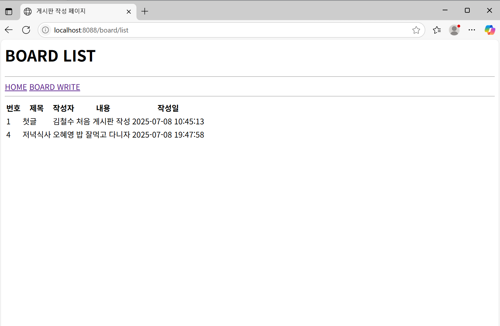
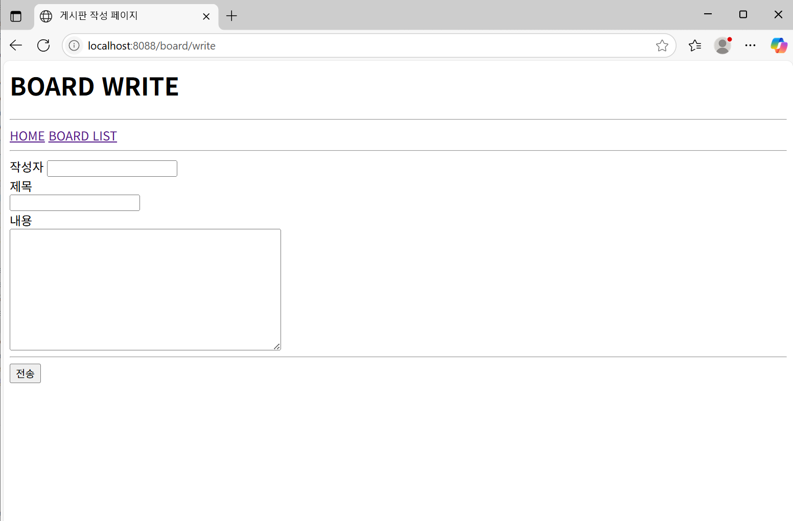

# 📌 SpringMVC 게시판 프로젝트

## 📝 프로젝트 소개
Spring MVC, JSP, Oracle DB 기반의 게시판 프로젝트입니다.  
게시글 목록 조회, 작성 기능을 기본으로 구현했습니다.

---

## 📄 버전  
1.0V
---

## 📂 프로젝트 구조

SpringMVC/
├── src/
│ ├── main/
│ │ ├── java/
│ │ │ └── com/example/
│ │ │ ├── controller/
│ │ │ │ ├── BoardController.java
│ │ │ │ └── HomeController.java
│ │ │ ├── dao/
│ │ │ │ ├── BoardDAO.java
│ │ │ │ └── BoardDAOImpl.java
│ │ │ ├── domain/
│ │ │ │ └── BoardVO.java
│ │ │ └── service/
│ │ │ ├── BoardService.java
│ │ │ └── BoardServiceImpl.java
│ │ ├── resources/
│ │ │ ├── mappers/
│ │ │ │ └── boardMapper.xml
│ │ │ ├── META-INF/
│ │ │ ├── log4j.xml
│ │ │ ├── log4j2.xml
│ │ │ ├── log4jdbc.log4j2.properties
│ │ │ └── mybatis-config.xml
│ ├── test/
│ │ ├── java/
│ │ └── resources/
├── Deployed Resources/
│ └── webapp/
│ ├── resources/
│ └── WEB-INF/
│ ├── classes/
│ ├── spring/
│ └── views/
│ └── board/
│ ├── list.jsp
│ └── write.jsp
│ └── home.jsp
│ └── web.xml
├── pom.xml

---

## ⚙️ 기술 스택

- Java 11
- Spring MVC 4.3.30
- JSP
- Oracle DB
- MyBatis
- Apache Tomcat 9
- Maven
- Log4j2 및 log4jdbc (로깅 및 DB 쿼리 로그)

---

## 🚀 주요 기능

- 게시글 목록 조회 (`/board/list`)
- 게시글 작성 (GET/POST `/board/write`)
- 홈 화면 (`/` or `/home`)

---

## 🛠️ 설치 및 실행 방법

1. Oracle DB에 게시판 테이블 및 시퀀스 생성

```sql
CREATE TABLE tbl_board (
    bno NUMBER PRIMARY KEY,
    title VARCHAR2(50) NOT NULL,
    content CLOB,
    writer VARCHAR2(30) NOT NULL,
    regDate DATE DEFAULT SYSDATE
);

CREATE SEQUENCE myBoard_seq START WITH 1 INCREMENT BY 1 NOCACHE NOCYCLE;
```

src/main/resources/mappers/boardMapper.xml에서 SQL 매퍼 확인 (insert 문에 시퀀스 myBoard_seq.nextval 사용)

web.xml 파일에 인코딩 필터(CharacterEncodingFilter) 설정 확인 (UTF-8)

톰캣 server.xml에서 <Connector> 태그에 URIEncoding="UTF-8" 추가 권장

Maven으로 빌드 후 톰캣에서 프로젝트 배포 및 실행

브라우저에서 다음 경로 접속

```
http://localhost:8088/board/list
```

📋 참고사항  
한글 깨짐 문제 발생 시 JSP, Spring 필터, 톰캣 인코딩 설정을 반드시 점검.

MyBatis 매퍼에서 CLOB 타입 파라미터는 jdbcType=CLOB으로 지정 필수.

게시글 번호(bno)는 시퀀스를 사용해 자동 생성.

---

📋 수정사항

---

🙋‍♂️ 개발자 정보  
이름: 최정규  
이메일: javakyu4030@naver.com


---

📷 실행 화면 예시

1. 홈화면

2. 게시판 리스트

3. 글 작성
